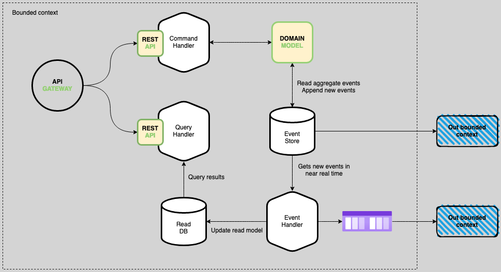
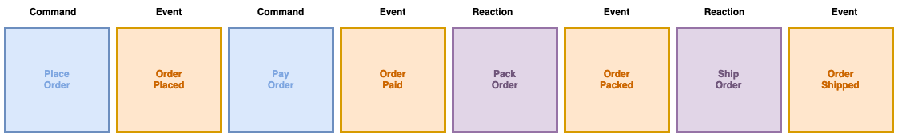
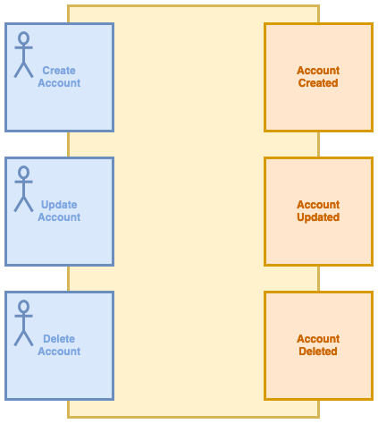
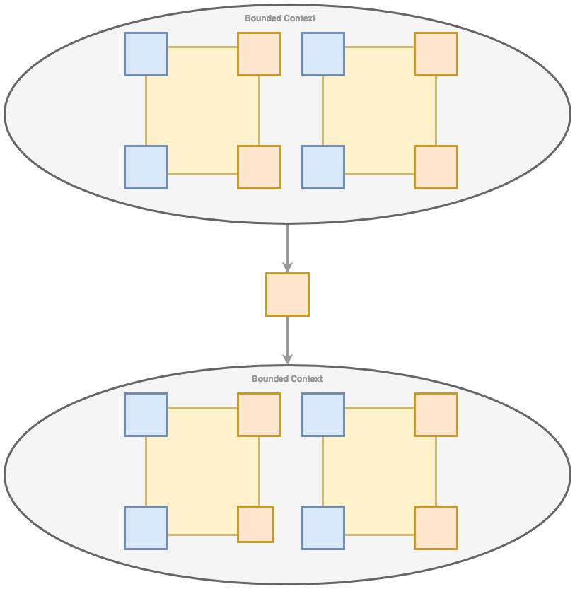
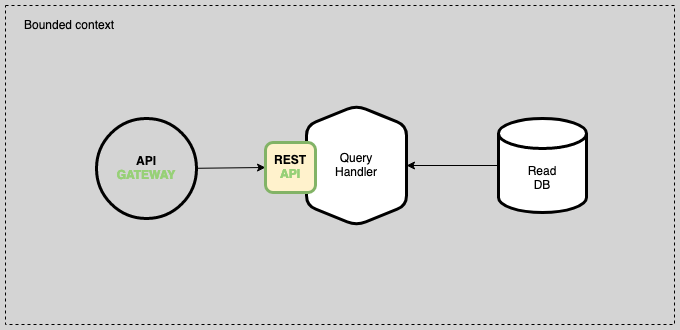

# event-sourcing-cqrs-rdbms-sample

# Resources and References
- [Modelling Reactive Systems with Event Storming and Domain-Driven Design](https://blog.redelastic.com/corporate-arts-crafts-modelling-reactive-systems-with-event-storming-73c6236f5dd7)
- [Event Sourcing and CQRS](https://www.eventstore.com/blog/event-sourcing-and-cqrs)
- [EventStoreDB is the database for Event Sourcing](https://reposhub.com/java/distributed-databases/evgeniy-khist-eventstoredb-event-sourcing.html?utm_source=pocket_mylist)

---
**Abstract.** Event Sourcing is a great way to automatically update state and publish events. The traditional way to persist an entity is to save its current 
state into a database. In Event Sourcing, a business object is persisted by storing a sequence of states changing events. Whenever an object's state changes, 
a new event is appended to the sequence of events. An entity's current state is reconstructed by replaying its events. Events are persisted in an Event Store, 
not only does the Event Store act as a database of events, it also behaves as a message broker. It provides an API that enables services to subscribe to events. 
The Event Store is the backbone of an Event-Driven microservice architecture. CQRS stands for Command Query Responsibility Segregation. CQRS promotes the separation 
of commands and queries. This concept has a serious influence on the application’s architecture. Now, the application should work independently with the “read” 
and “write” databases. There are actually two databases instead of just one, compared to when the traditional CRUD approach is used. The idea behind CQRS is that 
the whole application will work better when we separate the responsibility between different parts of code and different elements of the system.

# **Commands**

Commands are very similar to reactions, the only difference between commands and reactions is that commands are often initiated by users, while reactions are often 
initiated by events. Commands are critical because they often represent users interactions.

The main attribute of a command is that when the command gets successfully executed, the system transitions to a new state.

Another important attribute of a command is that it conveys the intent of the user. Requests like UpdateCustomer are not exactly commands according to CQRS. Within 
the application boundaries, handling a command should result in one transaction on one aggregate.

As a consequence, the command flow in CQRS goes hand in hand with the Task-Based User Interface pattern. In contrast with the CRUD-based user interface, which has 
four basic operations available for users - Create, Edit, Save and Delete, a task-based UI makes each operation explicit, like Check Out, Add Item or Cancel Order. 
By doing this, it makes operations available to the user easily translatable to commands that the UI sends to the Domain Model via an API.

# **Events**

An event represents a fact that took place in the domain. They are the source of truth, your current state is derived from the events. They are immutable and represent 
the business facts. Events are represented in the past tense. For example, **OrderPlaced, ProductAdded, OrderPaid, OrderPacked, OrderShipped.** Now we have to think 
of our business process purely in terms of events and reactions, which is a fancy way to say **"cause-and-effect"**. Important events cause reactions elsewhere in the 
system, and it’s often important to understand why those reactions occurred

# **Reactions**

A reaction is something that needs to happen after something else happens, **"This happens whenever that happens".** For example, for the following use case "Whenever 
a new user account is created, we will send an acknowledgement by email". UserAccountCreated → is the Event and SendAcknoledgementEmail → is the Reaction. Events are 
always past-tense, while Reactions are always future-tense.

# **Policies**

A policy is a flow of events and reactions together. A policy captures the core business rules. A policy does not need to represent a piece of software, it also may be 
a manual process or a combination of both an automated and manual process. A policy must include processes for when things go wrong, for example, What happens when a 
booking is not successfully confirmed?

# **Aggregates**

Aggregates logically group various commands, events, and reactions together. Aggregate events are relevant within the boundary of the aggregate itself, whereas domain 
events are relevant to a wider system.

Aggregate boundaries essentially communicate that _"These events are only interesting within the aggregate's boundaries – Any event emitted outside this boundary should 
be interesting to the domain"_

Aggregates bring structure to our design by isolating related concerns from one another.

# **Bounded Context**

Bounded context are used to create bulkheads within a large, complex system. Whereas aggregate boundaries group related behaviors together, bounded context group 
related language, meaning and culture. By defining bounded contexts, we can begin to understand how subdomains of the system interact to each other.

# **Event Store**

An Event Store is a database technology that stores your critical data in streams of immutable events. An event store is a type of database optimized for storage of 
events. They persist all state changing events for an object together with a timestamp, thereby creating time series for individual objects. The current state of an 
object can be inferred by replaying all events for that object from time 0 till the current time. In contrast, the other types of DBMS store the current state of an 
object (and loose the history, if not explicitly modelled).

# **Projections**

Projections are alternative store, which can be easily query. It could be a relational database or a document database, or a cache or any other type of persistence 
that is applicable for a specific use. Projections subscribe to the live feed of events database and when it receives an event, it could project the information in 
that event to a query model in a dedicated database.

# **Queries**

Queries, as the name suggest, allow getting data from the persistent store, so it can be shown to the user, sent to another system or used for any other purpose. 
Unlike commands, queries do not need to involve the Domain Model because queries do not execute any operations and should not contain any business logic. In addition, 
queries have no side effects and are completely idempotent, so it doesn’t matter how many times the query gets executed - it will always return the same result, unless 
the system state changed in the meantime.

